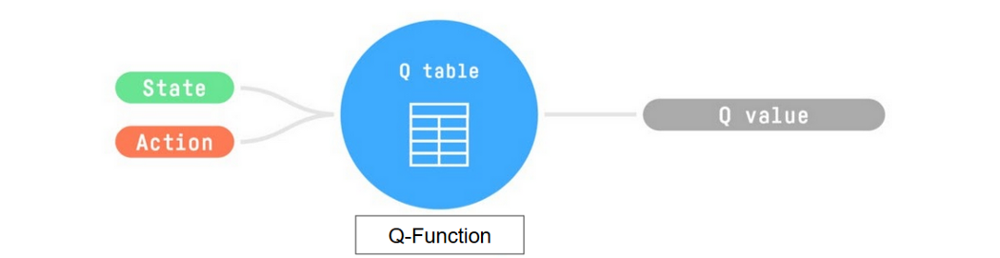

# Deep Q-Learning Network(DQN)

## 什么是Q-Learning
The Q comes from “the Quality” of that action at that state.
Q-Learning是一种离策略(off-policy)的基于价值(value-based)的方法,
它使用时序差分(TD, Temporal Difference)方法来训练其动作价值函数。

Q函数使用Q表来存储每个状态-动作对的值。给定一个状态和动作，我们的Q函数会在Q表中查找并输出对应的值。

我们所需要的`policy`: $\pi^*(s)$ 就是找出可以使Q值最大的Action
$$
\pi^*(s) = \arg\max_a Q^*(s,a)
$$

### 探索/利用

epsilon-贪心策略是一种处理探索/利用权衡的策略。

$$
\pi(a|s) = 
\begin{cases} 
(1-ε) + \frac{ε}{|A|}, & \text{if } a = \arg\max_{a'} Q(s,a') \\
(|A|-1)\frac{\epsilon}{|A|}, & \text{otherwise}
\end{cases}
$$

验证和为1:

$$
\begin{aligned}
\sum_{a} \pi(a|s) 
&= \underbrace{(1-\epsilon) + \frac{\epsilon}{|A|}}_{\text{最优动作概率}} + \underbrace{(|A|-1)\frac{\epsilon}{|A|}}_{\text{其他动作概率总和}} \\
\sum_{a} \pi(a|s) 
&= (1-\epsilon) + \frac{\epsilon}{|A|} + (|A|-1)\frac{\epsilon}{|A|} \\
&= 1-\epsilon + \frac{\epsilon}{|A|} + \frac{\epsilon|A|-\epsilon}{|A|} = 1-\epsilon + \epsilon = 1
\end{aligned}
$$
其中：

- $\pi(a|s)$是在状态s下选择动作a的概率
- $\epsilonε$ 是探索率
- $|A|$ 是动作集的大小
- $Q(s,a)$ 是状态-动作值函数

这个想法是,从初始值ε = 1.0开始;
在训练开始时,由于ε非常高,进行探索的概率将会很大,所以大多数时候我们会探索。
但随着训练的进行,我们的Q表在估计方面变得越来越好,我们逐渐降低epsilon值,
因为我们需要的探索越来越少,而需要更多的利用。

## 时序差分(TD, Temporal Difference)

为了得到我们的TD（时序差分）目标值，我们使用了即时奖励 Rt+1Rt+1​ 
加上下一个状态的折扣值，
这个折扣值是通过在下一个状态找到使当前Q函数最大化的动作来计算的。
（我们称之为自举/引导估计）。

$$
V(S_t) \leftarrow V(S_t) + \alpha[R_{t+1} + \gamma V(S_{t+1}) - V(S_t)]
$$
所以我们$Q(S_t, A_t)$公式表示为下面形式
$$
Q(S_t, A_t) \leftarrow Q(S_t, A_t) + \alpha[R_{t+1} + \gamma \max_{a}Q(S_{t+1}, a) - Q(S_t, A_t)]
$$

其中：
- α：学习率
- γ：折扣因子

## From Q-Learning to Deep Q-Learning

问题在于Q-Learning是一个基于表格的方法。当状态和动作空间太大而无法用数组和表格有效表示时，
这就成为了一个问题。换句话说：它不具有可规模化的能力。
Q-Learning只在状态空间较小的环境中表现良好，比如：

- FrozenLake, we had 16 states.
- Taxi-v3, we had 500 states.

Atari 游戏环境的观察空间形状为 (210, 160, 3)*，
其中包含的值范围从 0 到 255，这给我们带来了 256^(210×160×3) = 256^100800 
种可能的观察结果（相比之下，在可观测宇宙中大约有 10^80 个原子）。

Therefore, the state space is gigantic; due to this, 
creating and updating a Q-table for that environment would not be efficient. 
In this case, the best idea is to approximate the Q-values using a parametrized Q-function Qθ(s,a)Qθ​(s,a) .

This neural network will approximate, given a state, 
the different Q-values for each possible action at that state. 
And that’s exactly what Deep Q-Learning does.

